<div align="center">

  
  <h1>RecipeRumble</h1>
  
  <p>
    Recipe Rumble is a dynamic application built entirely in JavaScript using React Native Expo. It serves as a platform where users can engage in posting, voting, and exploring various recipes and food related competitions. With the ability to sign up and log in, users can personalize their experience by updating their profile images. The app ensures that all recipes are archived even after events have concluded, allowing users to revisit them at any time. Additionally, Recipe Rumble makes way to the discovery of new recipes and provides users with the option to share their own recipe creations.
  </p>
  
  
<!-- Badges -->
<p>
  <a href="https://github.com/EpicBlue1/RecipeRumble/graphs/contributors">
    
  </a>
  <a href="">
    
  </a>
  <a href="https://github.com/EpicBlue1/RecipeRumble/network/members">
    
  </a>
  <a href="https://github.com/EpicBlue1/RecipeRumble/stargazers">
    
  </a>
  <a href="https://github.com/EpicBlue1/RecipeRumble/issues/">
    
  </a>
  <a href="https://github.com/EpicBlue1/RecipeRumble/blob/master/LICENSE">
    
  </a>
</p>
  
</div>

<br />

<!-- Table of Contents -->

# :notebook_with_decorative_cover: Table of Contents

- [About the Project](#star2-about-the-project)
  - [Screenshots](#camera-screenshots)
  - [Tech Stack](#space_invader-tech-stack)
  - [Features](#dart-features)
  - [Color Reference](#art-color-reference)
- [Getting Started](#toolbox-getting-started)
  - [Prerequisites](#bangbang-prerequisites)
  - [Installation](#gear-installation)
  - [Run Locally](#running-run-locally)
  - [Deployment](#triangular_flag_on_post-deployment)
- [Roadmap](#compass-roadmap)
- [FinalProduct](#Final-Product)
- [Contributing](#wave-contributing)
  - [Code of Conduct](#scroll-code-of-conduct)
- [License](#warning-license)
- [Contact](#handshake-contact)
- [Acknowledgements](#gem-acknowledgements)

<!-- About the Project -->

## :: About the Project

<!-- Screenshots -->

### :: Idea Dump

<div align="center"> 
  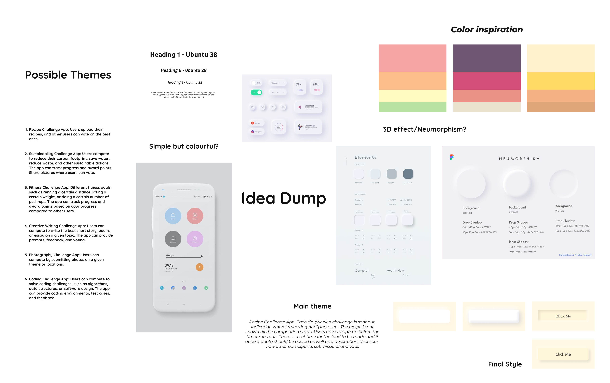
</div>

### :: Moodboard

<div align="center"> 
  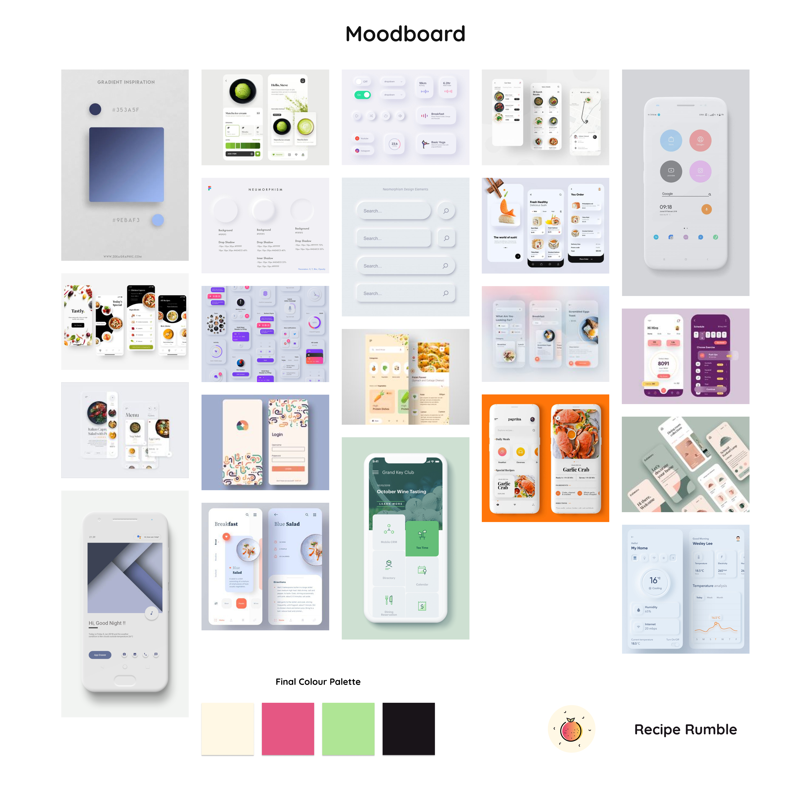
</div>

<!-- TechStack -->

### :: Tech Stack

<details>
  <summary>Client</summary>
  <ul>
    <li><a href="https://reactnative.dev/">React Native</a></li>
    <li><a href="https://expo.dev/">Expo</a></li>
  </ul>
</details>

<details>
  <summary>Server</summary>
  <ul>
    <li><a href="https://firebase.google.com/">Firebase</a></li>
  </ul>
</details>

<details>
<summary>Database</summary>
  <ul>
    <li><a href="https://firebase.google.com/docs/firestore/">Firestore</a></li>
  </ul>
</details>

<details>
<summary>DevOps</summary>
  <ul>
    <li><a href="https://www.figma.com/">Figma</a></li>
    <li><a href="https://www.blender.org/">Blender</a></li>
  </ul>
</details>

<!-- Features -->
<div align="center">
  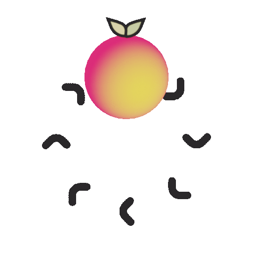
</div>

## :dart: Features

### :: Log In Screen

<div align="center"> 
  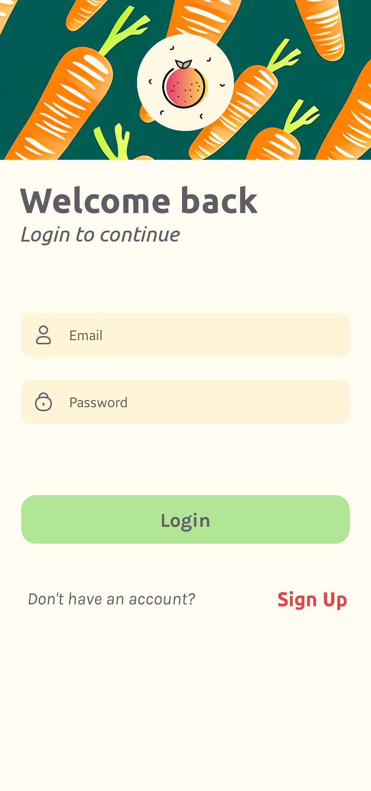
</div>

- Log In
- Validation
- Loading indicator

### :: Register Screen

<div align="center"> 
  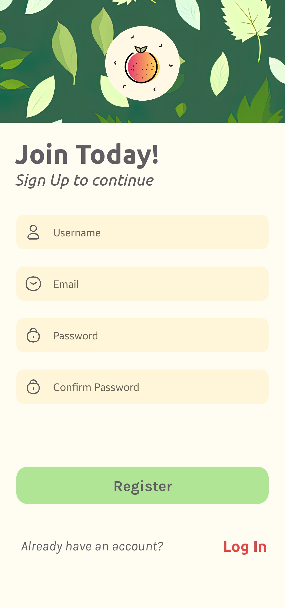
</div>

- Register new user
- Validation
- Loading indicator

### :: Competitions Screen

<div align="center"> 
  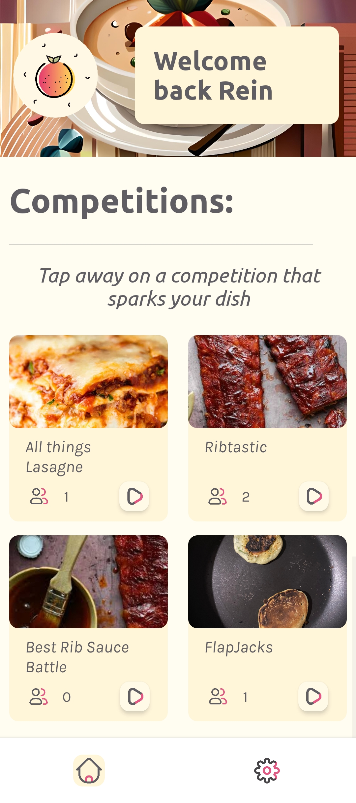
</div>

- View all competitions
- Display current logged in user
- Loading indicator

### :: Competition Screen

<div align="center"> 
  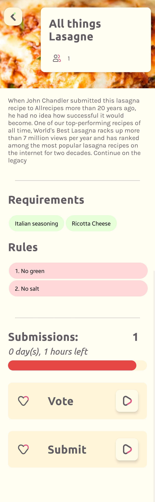
</div>

- Description, Required Ingredients, Rules, Banner Image
- Progress bar and indication on how long the event is still going to be active for
- Submit button to submit own entry
- Vote button to vote other entries within this competition

### :: Profile Screen

<div align="center"> 
  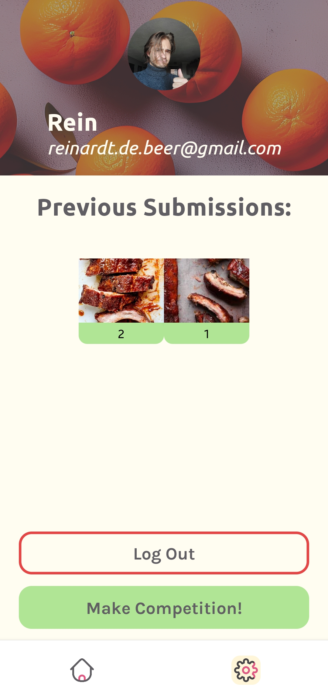
</div>

- View Previous submissions
- Update profile picture
- Log Out
- Create competition

### :: Submit Screen

<div align="center"> 
  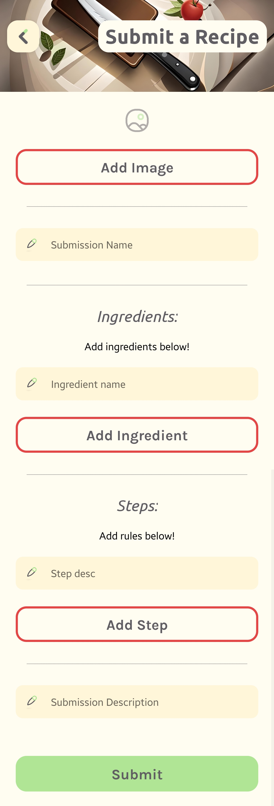
</div>

- Upload picture
- Ingredients Section, Steps Section, Description Section

### :: Voting Screen

<div align="center"> 
  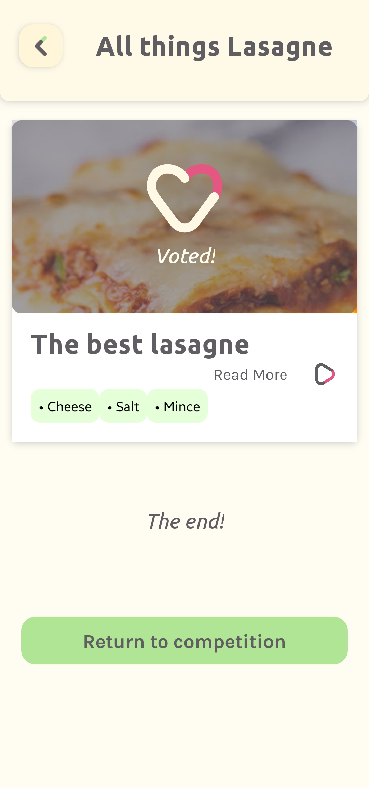
</div>

- Double tap to vote
- View more on the recipe before voting
- Ingredients preview on voting card
- Loading indicator

### :: Leaderboard Screen

<div align="center"> 
  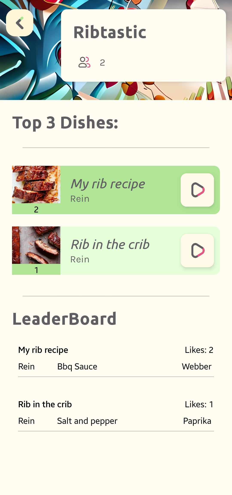
</div>

- Top 3 recipes
- View Recipes

<!-- Color Reference -->

### :art: Color Reference

| Color              | Hex                                                              |
| ------------------ | ---------------------------------------------------------------- |
| Dirty_White        |  #FFFCF2 |
| Dirty_White_Dark   |  #FFF9E8 |
| Dirty_White_Darker |  #FFF5D9 |
| Red                |  #E54545 |
| Green              |  #AFE595 |
| LightRed           |  #FFD9D9 |
| LightGreen         |  #E5FFD9 |

<!-- Getting Started -->

## :toolbox: Getting Started

<!-- Prerequisites -->

### :bangbang: Prerequisites

This project uses npm as package manager

<!-- Installation -->

### :gear: Installation

Clone the project

```bash
  git clone https://github.com/EpicBlue1/RecipeRumble.git
```

```bash
  npm install
```

Start the server

```bash
  npm start
```

Make sure you have expo installed on your mobile device
Scan qr code with Ios or Android Device.

<!-- Roadmap -->

## :compass: Roadmap

⬜ Like only once
⬜ Navbar indicator
✅ Show a few ingredients on the vote card
✅ Profile Picture update and name?
✅ Previous submissions
✅ Individual view
✅ Leaderboard
✅ Date and competition over func
✅ Vote and submit buttons replace with leaderboard
✅ Circle event timer
✅ Fix styling on iphone
✅ Navigate when registered
✅ Context
✅ Real Competitions
✅ Can Submit
✅ Real Postings

# :: Final Product

<div align="center"> 
  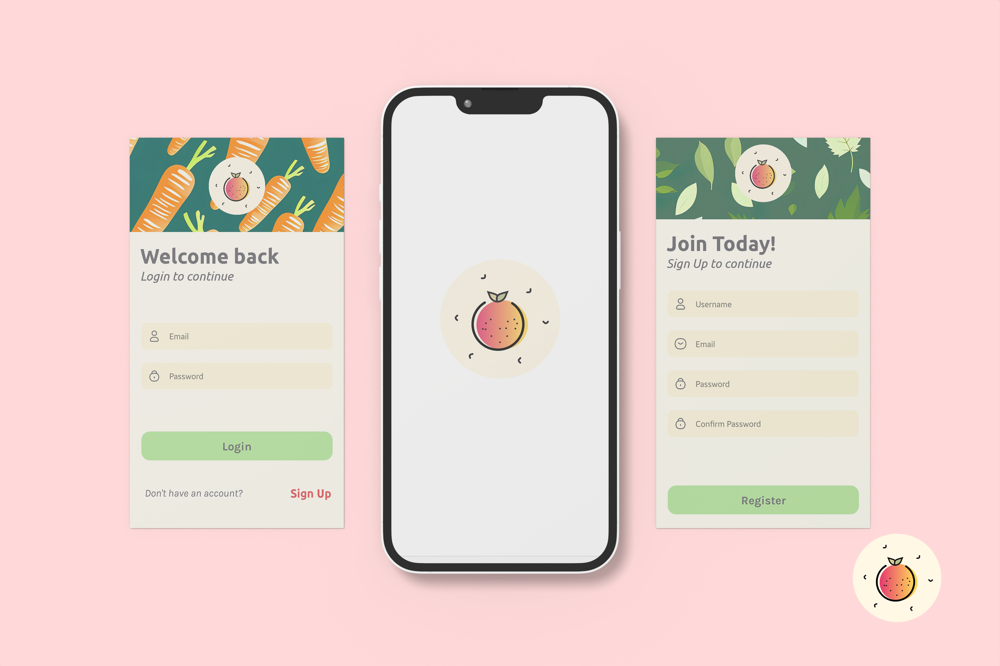
</div>

<div align="center"> 
  
</div>

<div align="center"> 
  
</div>

<!-- Contributing -->

## :wave: Contributing

<a href="https://github.com/EpicBlue1/RecipeRumble/graphs/contributors">
  
</a>

<!-- Code of Conduct -->

### :scroll: Code of Conduct

Please read the [Code of Conduct](https://github.com/EpicBlue1/RecipeRumble/blob/master/CODE_OF_CONDUCT.md)

<!-- License -->

## :warning: License

Distributed under the no License. See LICENSE.txt for more information.

<!-- Contact -->

## :handshake: Contact

Project Link: [https://github.com/EpicBlue1/RecipeRumble](https://github.com/EpicBlue1/RecipeRumble)

<!-- Acknowledgments -->

## :gem: Acknowledgements

Use this section to mention useful resources and libraries that you have used in your projects.

- [Awesome README](https://github.com/matiassingers/awesome-readme)
- [Readme Template](https://github.com/othneildrew/Best-README-Template)
